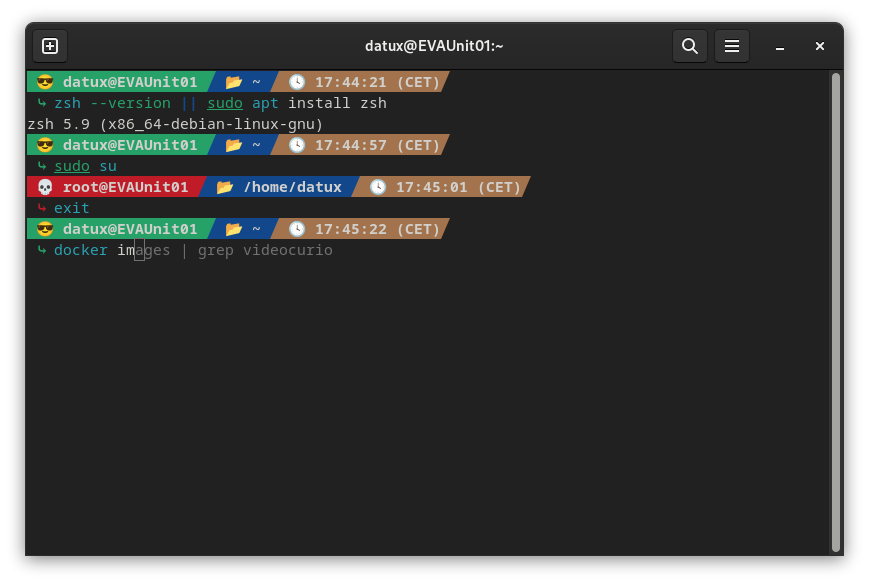

# My personal zshrc file

## Summary

An elegant Zsh prompt with current user, machine name, virtual environment, current directory, and time (with current timezone).



## Install

### Prerequisites

- [Zsh](https://www.zsh.org) should be installed (v5.0.8 and newer).
- `curl` or `wget` should be installed

### Basic installation
```bash
# Make sure zsh is installed (on Debian based Linux distro):
zsh --version || sudo apt install zsh
# Backup your previous version, if any:
cp ~/.zshrc ~/.zshrc.old.bak
# Download my zshrc:
curl -o .zshrc https://raw.githubusercontent.com/VideoCurio/MyZSH/master/zshrc
# Start it:
zsh
# Source it:
source $HOME/.zshrc
```

### Make ZSH your default shell:
```bash
sudo chsh -s /bin/zsh $USER
```
or modify manually the file `/etc/passwd` and reboot your computer.

## Features

- Custom theme and color prompt.
- Red prompt if you are logged as root.
- Modern command completion system based on your shell history. 
- `update` will do a complete `apt` update and upgrade, and also a flatpak update. Modify it on non Debian based distro.
- `history` show the complete history with timestamp.
- Auto updated terminal window title.
